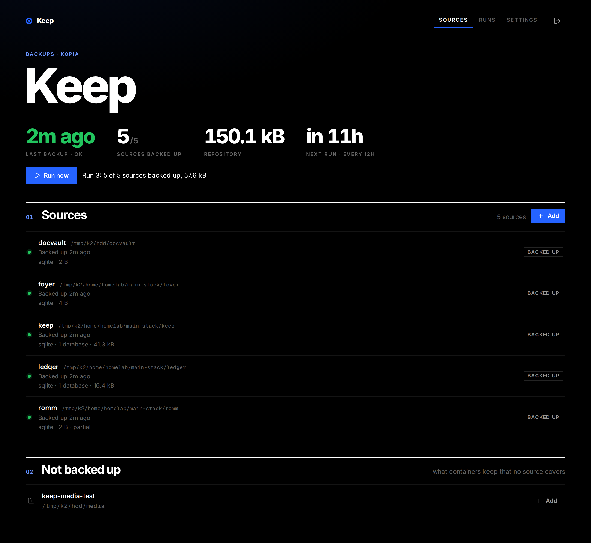

# Keep

Homelab backup orchestrator: consistent database dumps, Kopia snapshots, Lookout heartbeats.

Keep decides **when** and **how** the homelab is backed up. A proven engine
([Kopia](https://kopia.io)) does the storage: chunking, dedup, encryption,
retention and the upload. Keep never touches any of that. It makes each
backup consistent, runs it, reports on it, keeps the history, checks the
repository every week, keeps a second repository on another disk, and
restores into a folder of its own.



One small Go binary with the web UI built in, data in SQLite, ~12 MiB idle.

## What a run does

Every 12 hours (or on **Run now**, here or on Foyer's card), for each source:

1. **Prepare** it, by its strategy:
   - `sqlite` (the default): finds every SQLite database by its file header
     and copies it into staging with `VACUUM INTO`, a consistent copy even
     while the app writes. The live database and its `-wal`/`-shm` files are
     left out of the snapshot, and the copy goes in. If a database can't be
     copied, the live file stays in and the run warns.
   - `postgres` / `mariadb`: `pg_dumpall` / `mariadb-dump --single-transaction`
     inside the database's container, using the credentials it was started
     with, so Keep never holds them.
   - `stop`: stops the containers, snapshots, and starts again only those
     it stopped.
   - `files`: nothing to prepare.

   A source's **before hook** (a command run with `sh -c` in a container you
   name) runs first; if it fails, the source fails and isn't snapshotted.
   Its **after hook** runs once the snapshot is done or has failed; if it
   fails, the source ends with a warning.
2. **Snapshot** the folder and the staged copies through the engine. Keep
   turns the engine's own schedule off for these paths and sets their
   excludes.
3. **Report**: it records the run and pings a heartbeat (`/start`, then the
   URL itself, or `/fail`).

A source is **stale** when its last good backup is older than `stale_after`
(default: twice the interval plus an hour).

## Run it

Keep tells the engine "snapshot `/data/ledger`", and the engine reads its own
`/data/ledger`. So Keep and the engine's container must see every source,
and the staging folder, **at the same paths**. Keep checks this through
both containers' mounts before each snapshot and fails the source loudly
if they differ. The restores folder (next to staging, `$KEEP_DATA_DIR/restores`
by default) must be there too, and **writable** for the engine, which
writes the restored files. The data can stay read-only for it:

```yaml
  kopia:
    volumes:
      - /home/me:/home/me:ro
      - /home/me/stack/keep/restores:/home/me/stack/keep/restores
```

```yaml
services:
  keep:
    image: ghcr.io/audemed44/keep:latest
    restart: unless-stopped
    user: "1000:1000"
    group_add: ["988"] # the docker group's id: getent group docker
    environment:
      - KEEP_TOKEN=${KEEP_TOKEN} # openssl rand -hex 32
      - KEEP_DATA_DIR=/home/me/stack/keep # keep.db and staging
      - KEEP_HEARTBEAT_URL=${KEEP_HEARTBEAT_URL}
    volumes:
      # The same host paths in Keep and the engine's container.
      - /home/me:/home/me
      - /mnt/hdd:/mnt/hdd
      - /var/run/docker.sock:/var/run/docker.sock
    ports:
      - "8091:8080"
    mem_limit: 64m
```

Mounting your data folders at their real paths in both containers means
the paths in Keep's UI are host paths, and adding a folder anywhere under
them never needs a compose change. They're read-write for Keep because
SQLite has to touch a WAL database's `-shm` file even to read it; Keep
writes nothing outside its own folder. See [docker-compose.example.yml](docker-compose.example.yml).

| Variable | Default | |
|---|---|---|
| `KEEP_TOKEN` | (required) | What you sign in with; also Foyer's widget key |
| `KEEP_DATA_DIR` | `/data` | Where `keep.db` and staging live |
| `KEEP_CONFIG` | `$KEEP_DATA_DIR/keep.yml` | A version 1 config to import once |
| `KEEP_HEARTBEAT_URL` | | A Lookout or healthchecks.io ping URL |
| `KEEP_DOCKER_SOCKET` | `/var/run/docker.sock` | |
| `KEEP_CONTAINER` | the hostname | Keep's own container, to find host paths |
| `KEEP_PORT` | `8080` | Port inside the container |
| `HOMEPAGE_URL` | | Foyer's address, linked from the header |
| `KEEP_DEBUG` | | Set to log debug messages |

## Choosing what to back up

Everything is set in the UI and kept in Keep's database:

- **Add** on the Sources page opens a folder picker over the folders Keep
  can see (its bind mounts). A folder becomes one source, or a **watched
  folder**: every folder inside it is a source named after it, including
  ones added later.
- **Not backed up** lists what containers mount that no source covers,
  read from the Docker socket, each with an Add button. Database containers
  (Postgres, MariaDB) get a dump source; other Docker volumes are listed so
  you know they aren't covered.
- A suggestion left out on purpose can be **ignored**; Settings lists the
  ignored ones. Foyer's card says how many data folders aren't backed up.
- Each source's page has **Edit** (strategy, containers to stop, what to
  leave out, hooks), **Restore** and **Stop backing up**. For a folder in a watched folder that
  means skipping it; the snapshots stay in the repository.
- **Settings**: schedule, how many snapshots to keep (set on every path in
  Kopia, so retention lives in Keep), patterns left out everywhere, the
  verify, the local copy, old snapshots, the engine's container, staging
  and restores.

Excludes use the part of gitignore syntax Kopia and restic read the same
way: `/x` from the top of the source, `name` at any depth, `dir/` for
folders only. `**` and `!` aren't supported. A source's excludes replace
Kopia's own ignore rules for that path, including any inherited from a
parent folder's policy.

A `keep.yml` from version 1 is imported once on start and renamed to
`keep.yml.imported`.

## Speed

Every Kopia command opens the repository, which takes 20–50 s over rclone
to Google Drive. So a run prepares every source first, then takes all the
snapshots with one `kopia snapshot create`, and sets a path's policy only
when it changed. Keep remembers what it set and reads it back once a week
or so: each path comes due 7–13 days after it was set (from a hash of the
path, so they don't all come due together), and the due ones are read with
one `kopia policy show`. The repository size comes from `kopia content
stats`, which reads the local index cache. A run is two Kopia commands plus
the upload.

Restores are slow in another way: each file is its own request to Drive
(about 5 s), so Keep restores 32 files at a time.

## Verify

Once a week (**Verify now** in Settings), Keep runs `kopia snapshot verify`,
which checks every snapshot's structure and reads a share of the files back
(5% by default). Every problem it finds goes in the log and fails the job.
It's a job of its own, with its own heartbeat (set in Settings), so a failing
check doesn't look like a failing backup. The verify also refreshes Keep's
copy of the snapshot list, which restores and old snapshots read.

## Local copy

Set a folder under **Local copy** in Settings, on another disk than the
data, and every backup also snapshots each source into a second, separate
repository there: from the same prepared files, right after the main
repository, in one more engine call. It doesn't depend on the main
repository or the network, so it's still there if those are lost, and a
backup that's in it is restored from it (nothing comes from Drive).

- Keep creates the repository in an empty folder the first time, with the
  engine container's password (`KOPIA_PASSWORD`), and keeps Kopia's
  connection to it in its own config file (`/app/config/keep-local.config`,
  cache in `/app/cache/keep-local`). Kopia runs its own maintenance on it.
- The two repositories must never share a cache: Kopia would mix up their
  format, indexes and own writes. Kopia takes `KOPIA_CACHE_DIRECTORY` (which
  the Kopia image sets) over the cache folder in a config file, so Keep sets
  it on every command for the local repository. Each time Keep opens it, it
  also checks the repository Kopia opened is the one in the folder (the
  unique ID against the folder's `kopia.repository.f`) and won't use it
  otherwise. Without Keep: `env KOPIA_CACHE_DIRECTORY=/app/cache/keep-local
  kopia --config-file=/app/config/keep-local.config snapshot list`.
- It's a separate repository, not a copy of the main one: damage in one
  can't reach the other. Retention is the same, the verify checks both, and
  old snapshots are deleted from both.
- A source that fails there isn't a failed backup: it's noted on the run
  (a warning) and on the local copy's own heartbeat, if one is set. A
  source the main repository failed still goes in the local copy.
- The folder can't be inside anything that's backed up, staging or
  restores. The engine must see it at the same path, read-write:

```yaml
  kopia:
    volumes:
      - /mnt/hdd:/mnt/hdd:ro
      - /mnt/hdd/keep-repo:/mnt/hdd/keep-repo
```

## Old snapshots

Snapshots of folders Keep doesn't back up now (from before Keep, or of a
source since removed) never expire: nothing snapshots those paths any more.
Settings lists them with a **Delete after** date; the first verify on or
after it deletes all of that path's snapshots. Each one's newest snapshot
can be restored from there too.

## Foyer

Keep serves a [Foyer](https://github.com/audemed44/foyer) card at
`/api/foyer/widget` (last run, sources backed up, repository size, next run,
**Run now**), and `/api/foyer/backups` for Foyer's topology map: every
source as a host path or Docker volume, with its state.

```yaml
      - name: Keep
        url: https://keep.example.com
        container: keep
        widget:
          type: keep # or app, for the card alone
          url: http://keep:8080
          key: ${KEEP_TOKEN}
```

## Restoring

**Restore** on a source's page: pick one of its backups, then everything or
one file or folder in it. Keep writes it to a folder of its own,
`restores/<source>-<date>-<id>`, laid out like the source, with the
database copies back where the live databases were. Nothing is ever
restored over an app's files; moving things back is up to you. The
**Restores** page browses them and downloads single files. Restores are
deleted after 7 days.

Without Keep, the snapshots are ordinary Kopia snapshots (`kopia snapshot
list /data/ledger`). A SQLite source's databases are in the snapshot of
`<staging>/<source>`, at the same relative paths, and a database source's
dump is `<staging>/<source>/<source>.sql`.

## Engine

The engine sits behind one interface (`internal/engine`). Kopia is the only
one; restic was considered and is on hold while Kopia's verifies come back
clean.

## Development

```sh
cd frontend && npm install && npm run build && cd ..
KEEP_TOKEN=dev KEEP_DATA_DIR=./data go run ./cmd/keep
# or, with hot reload: run the binary, then `npm run dev` in frontend/
```
